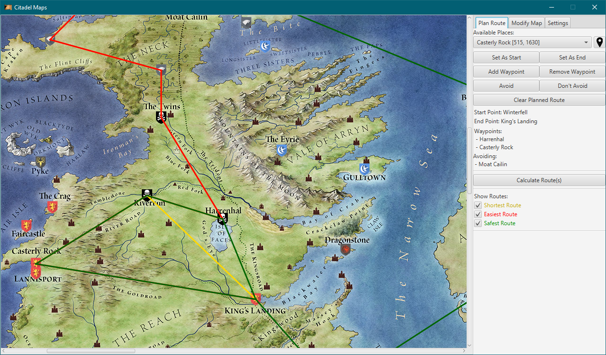

# Westeros Route Finder

Data Structures & Algorithms 2 - Assignment 2

By Dylan Gore (20081224)

***

> “Create a route finder for the known world of A Song of Ice and Fire (Game of Thrones) series.”

The objective of this team CA exercise is to create an interactive application that can search for and
retrieve various routes between specified towns/cities in the “known world” as depicted in George R.
R. Martin’s A Song of Ice and Fire book series, which is the basis for the TV series Game of Thrones.

